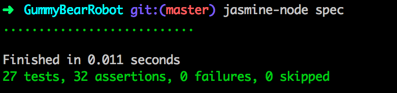
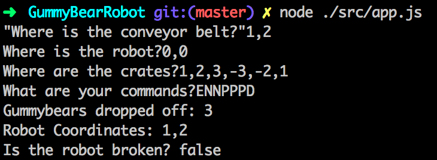

# The Gummybear Robot

Are you sick and tired of laborious warehouse work? Well this is the solution for
you! This robot will do all of your work for you, from picking up gummybears to
delivering them to the conveyor belt.

## The Challenge

Rainforest LTD is an online distribution company that specialises in selling bags
of sugar-free gummy bears.  They have a large warehouse in Milton Keynes where
crates of the bags are stored.
A new remote-controlled robot is being tested at the warehouse.  The robot can
move around the warehouse floor, reach into crates to pick up bags of gummy bears,
and drop the bags off at a conveyor-belt feeder. The robot is only able to pick up
one bag at a time, but can carry multiple bags at once.  However when dropping
off the bags the robot drops all the bags in its possession at once.

The robot is controlled with the following instructions:

   __N__, __S__, __E__, __W__  - the robot moves one unit of distance in the
   direction specified

   __P__ - pick up one bag of sugar-free gummy bears from a crate.

   __D__ - drop the bags of sugar-free gummy bears that the robot currently has in its possession onto the conveyor-belt feeder.

   A couple of issues with the robot have been found:

   If the robot tries to retrieve a bag from a position where a crate doesn’t reside, it falls over and short-circuits.  From this point onwards it no longer responds to instructions.

   If the robot tries to drop bags off at a position that is any place other than the conveyor-belt feeder, the bags get caught in its wheels and it short-circuits.  In this instance it also no longer responds to instructions.

## The Task

Your task is to develop an application that takes in the following lines of input:

__i)__ The x, y coordinates of the position of the conveyor-belt feeder

__ii)__ The x, y coordinates of the start position of the robot

__iii)__ comma separated descriptions of the crates.  Each crate has an x coord, y coord and quantity.

__iv)__ A set of instructions for the robot to perform.

The application should respond with the total number of bags dropped on the conveyor-belt feeder, and the final position and health of the robot.

## My Solution

I broke down the problem to its most simple constituent parts. Here is what everything
does:

__Gummybear__: This does nothing. It is just a gummybear.

__Crate__: On construction, this is given coordinates and a number of gummybears that
it contains.

__ConveyorBelt__: On construction, this is given coordinates and no gummybears. When
a robot delivers gummybears to it, the belt's gummybear array takes them.

__Warehouse__: On construction, this is given 4 numbers. These outline the limits
of the warehouse. The warehouse has the ability to add crates and a conveyorbelt to
its premises.

__Robot__: On construction, this is given coordinates, and no gummybears. It also has
the ability to breakdown.

__Operator__: This is the controller of the robot in the warehouse. It can order
the robot to move, pick up gummybears and also drop them.

__App__: This is the whole shebang! It asks for user input to set the coordinates of
the constructors above. It also takes in a set of commands for the robot to accomplish.
Once this is complete, it returns the results.

## How to Run

First things first, lets get this app on your computer and set it up. To do
this type the following commands into your terminal

```
$ git clone git@github.com:jackbittiner/GummyBearRobot.git
$ cd GummyBearRobot
```

Make sure you have node installed on your computer and then run the following
command to get set up:

```
$ npm install
```

We're good to go!

#### Tests

This application was test-driven. To run the tests type the following into
the terminal:

```
$ jasmine-node spec
```

You should see the following:



(ALL IN THE GREEN! What a beautiful sight!)

#### The App

To start the application, type the following in the command line.

```
$ node ./src/app.js
```

You will see the following questions:

"Where is the conveyor belt?" - Answer with coordinates that are comma
separated eg/ -1,2

Where is the robot? - Answer with coordinates that are comma
separated eg/ -1,2

Where are the crates? = Answer with coordinates and quantity of gummybears
that are comma separated eg/ -1,2,10 - if you wish to have multiple crates,
just write them side by side comma separated eg/ 1,2,3,-1,-2,1 - this will
create two crates.

What are your commands? - Use the commands stated above (N,E,S,W,P,D) to order
the robot around. Just do them side by side, capitalised and with no commas eg/
NPSEWPSSD

Once you've done this, it will display your results. If all has gone perfectly
to plan, it should look like the following image:



## Technologies Used

__Node.js__: This is a node app that is run in the terminal.
All the actual code is written in Javascript

__Jasmine__: I used the node jasmine package for testing. I was
considering using Mocha and Chai, but as I have more familiarity with
Jasmine, I chose to use it so I could just crack along with it quicker.

## What Next With More Time?

I hadn't asked for user input in a Node app before so I struggled a bit with
how this should be done. By all means, it works, and I'm happy it works, but it
could almost definitely be tidier and done more effectively. This is something
I'm going to look.

I'm not entirely sure if the way I required exported and required files is the
correct way to do it. I just focused on getting it all to work first. With a
greater understanding of Node, I'm sure I can stick to the correct protocol.

As you might have noticed, I gave my warehouse limitations and a set of all
possible coordinates inside it. The default size goes from -3 to 3 on the x&y coordinates.
My intention here was to have it that a robot,
crate or conveyor belt can't be constructed outside the warehouse. I was also
planning that no two crates or conveyor belts can have the same coordinates.
I ALSO planned for the robot to not be able to move to a coordinate outside
the warehouse (and potentially break if it hit the boundary as this robot is
quite prone to breakdown). This is what I would work on next, but I ran out of
time and it is superfluous to the task at hand.

Further tests for the whole feature. I know it works, because I've ran it
countless times. However I don't have any tests yet that mock the behaviour of the
user input and the ensure the final result is as expected.

A big refactor. I got the code working. But it could definitely be a little
cleaner!

## Thank you

Thank you for taking the time to peruse over this tech test. I hope it's up to
scratch! Enjoy bossing the robot about and say goodbye to laborious warehouse
work.
